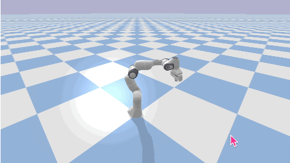

# DORA-RS Franka Panda Robot Driver

A DORA-RS driver node for controlling Franka Panda robot arm. This driver uses PyBullet for simulation and accepts target joint goals and Cartesian poses via DORA dataflow.



## Features

- 7-DOF joint control for Franka Panda robot
- Cartesian pose control with inverse kinematics
- Gripper control (open/close)
- PyBullet physics simulation with optional GUI
- Compatible with real Franka robot (requires libfranka)

## Prerequisites

### 1. Install DORA-RS

Install the DORA CLI (v0.3.11):

```bash
# Using cargo (recommended)
cargo install dora-cli --version 0.3.11

# Check version
dora --version
```

### 2. Install Python Dependencies

**IMPORTANT**: The dora-rs Python package version must match the dora-cli version exactly.

```bash
pip install -r requirements.txt

# Verify versions match
dora --version        # Should show 0.3.11
pip show dora-rs      # Should show 0.3.11
```

## Project Structure

```
franka/
├── franka_driver_node.py   # Main DORA driver node (PyBullet simulation)
├── goal_publisher_node.py  # Example goal publisher for testing
├── dataflow.yml            # DORA dataflow configuration
├── requirements.txt        # Python dependencies
└── README.md
```

## Usage

### Quick Start

1. Run the DORA dataflow:

```bash
dora up
dora start dataflow.yml
```

2. Monitor the logs:

```bash
dora logs franka_driver
```

3. Stop the dataflow:

```bash
dora stop
dora destroy
```

### Running with GUI

Set `FRANKA_GUI: "true"` in dataflow.yml to see the PyBullet visualization:

```yaml
env:
  FRANKA_GUI: "true"
```

## Node Interfaces

### Inputs

| Input ID | Format | Description |
|----------|--------|-------------|
| `target_joints` | JSON | Target joint angles (7 values) in radians |
| `target_pose` | JSON | Target Cartesian pose |
| `command` | String | Control commands |
| `gripper` | String/Float | Gripper commands |

#### target_joints Format

Simple array:
```json
[0.0, -0.785, 0.0, -2.356, 0.0, 1.571, 0.785]
```

With parameters:
```json
{
  "joints": [0.0, -0.785, 0.0, -2.356, 0.0, 1.571, 0.785],
  "velocity": 0.3,
  "wait": true
}
```

#### target_pose Format

```json
{
  "x": 0.4,
  "y": 0.0,
  "z": 0.5,
  "rx": 3.14,
  "ry": 0.0,
  "rz": 0.0
}
```

#### Commands

| Command | Description |
|---------|-------------|
| `start` | Connect to simulation |
| `stop` | Disconnect from simulation |
| `home` | Move to home position |
| `get_joints` | Get current joint positions |
| `get_pose` | Get current end-effector pose |

#### Gripper Commands

| Command | Description |
|---------|-------------|
| `open` | Open gripper (0.04m width) |
| `close` | Close gripper (0.0m width) |
| `0.0-0.04` | Set specific finger width |

### Outputs

| Output ID | Format | Description |
|-----------|--------|-------------|
| `current_joints` | JSON array | Current 7 joint positions in radians |
| `current_pose` | JSON object | Current end-effector pose |
| `status` | String | `idle`, `moving`, `completed`, `error`, `stopped` |
| `error` | JSON | Error details when status is `error` |

## Configuration

### Environment Variables

Set these in `dataflow.yml` or export before running:

| Variable | Default | Description |
|----------|---------|-------------|
| `FRANKA_SIMULATION` | `true` | Use PyBullet simulation |
| `FRANKA_GUI` | `false` | Show PyBullet GUI |
| `FRANKA_TIME_STEP` | `0.001` | Simulation time step |
| `FRANKA_MAX_VELOCITY` | `0.5` | Max joint velocity (rad/s) |
| `FRANKA_MAX_FORCE` | `240.0` | Max joint force (N) |

## Franka Panda Specifications

### Joint Limits (radians)

| Joint | Lower Limit | Upper Limit |
|-------|-------------|-------------|
| J1 | -2.8973 | 2.8973 |
| J2 | -1.7628 | 1.7628 |
| J3 | -2.8973 | 2.8973 |
| J4 | -3.0718 | -0.0698 |
| J5 | -2.8973 | 2.8973 |
| J6 | -0.0175 | 3.7525 |
| J7 | -2.8973 | 2.8973 |

### Home Position

```python
home_position = [0.0, -0.785, 0.0, -2.356, 0.0, 1.571, 0.785]
```

## Integration Examples

### With Motion Planner

```yaml
nodes:
  - id: motion_planner
    path: your_planner.py
    inputs:
      goal: user_input/goal
    outputs:
      - joints

  - id: franka_driver
    path: franka_driver_node.py
    inputs:
      target_joints: motion_planner/joints
    outputs:
      - current_joints
      - status
```

### With Vision System

```yaml
nodes:
  - id: camera
    path: camera_node.py
    outputs:
      - image

  - id: vision
    path: vision_node.py
    inputs:
      image: camera/image
    outputs:
      - target_pose

  - id: franka_driver
    path: franka_driver_node.py
    inputs:
      target_pose: vision/target_pose
    outputs:
      - status
```

## Troubleshooting

### PyBullet Not Starting

1. Ensure pybullet is installed:
   ```bash
   pip install pybullet
   ```

2. Check for display issues (for GUI mode):
   ```bash
   export DISPLAY=:0  # Linux
   ```

### DORA Not Starting

1. Ensure DORA daemon is running:
   ```bash
   dora up
   ```

2. Check dataflow syntax:
   ```bash
   dora check dataflow.yml
   ```

### Node Initialization Error

If you see `RuntimeError: Could not initiate node from environment variable`:

1. **Version mismatch** - The dora-rs Python package version must match dora-cli:
   ```bash
   # Check versions
   dora --version
   pip show dora-rs

   # Fix by installing matching version
   pip install dora-rs==0.3.11  # Match your CLI version
   ```

2. **Restart DORA daemon after fixing**:
   ```bash
   dora destroy
   dora up
   dora start dataflow.yml
   ```

## Real Robot Support

For real Franka Panda robot support, you would need:
- libfranka installed
- Franka Control Interface (FCI) access
- Real-time kernel (recommended)

Replace PyBullet calls with libfranka calls for real robot control.

## License

MIT License
