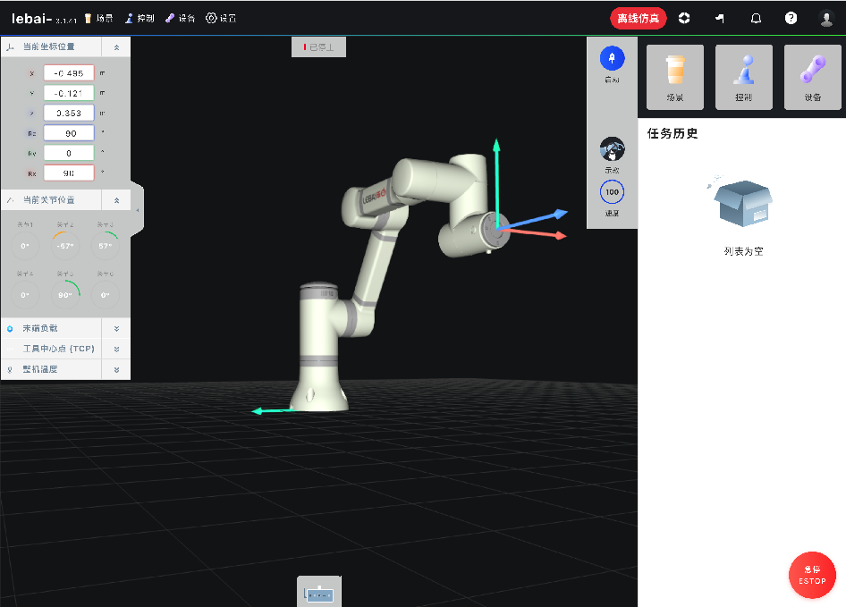

# DORA-RS Lebai Robot Driver

A DORA-RS driver node for controlling Lebai LM3 robot arm. This driver accepts target joint goals and Cartesian poses via DORA dataflow and controls the robot accordingly.

## Prerequisites

### 1. Lebai L-Master Docker

Start the Lebai simulator:

```bash
docker run -d --name lebai-master \
  -p 80:80 \
  -p 5180:5180 \
  -p 5181:5181 \
  lebai/lmaster:latest
```

Verify the simulator is running by opening: http://localhost/dashboard


### 2. Install Python Dependencies

**IMPORTANT**: The dora-rs Python package version must match the dora-cli version exactly.

```bash
pip install -r requirements.txt

# Verify versions match
dora --version        # Should show 0.3.11
pip show dora-rs      # Should show 0.3.11
```

## Project Structure

```
lebai/
├── lebai_driver_node.py   # Main DORA driver node
├── goal_publisher_node.py # Example goal publisher for testing
├── dataflow.yml           # DORA dataflow configuration
├── requirements.txt       # Python dependencies
├── LM3_test.py           # Original standalone test script
└── README.md
```

## Usage

### Quick Start

1. Start the Lebai simulator (see Prerequisites)

2. Run the DORA dataflow:

```bash
dora up
dora start dataflow.yml
```
and you should see robot arm movement from simulator:




3. Monitor the logs:

```bash
dora logs lebai_driver
```

4. Stop the dataflow:

```bash
dora stop
dora destroy
```

### Running Individual Nodes

For development/testing, run nodes directly:

```bash
# Terminal 1: Start DORA daemon
dora up

# Terminal 2: Start the dataflow
dora start dataflow.yml

# Or run standalone for testing
python lebai_driver_node.py
```

## Node Interfaces

### Inputs

| Input ID | Format | Description |
|----------|--------|-------------|
| `target_joints` | JSON | Target joint angles in radians |
| `target_pose` | JSON | Target Cartesian pose |
| `command` | String | Control commands |

#### target_joints Format

Simple array:
```json
[0.0, -1.0, 1.0, 0.0, 1.57, 0.0]
```

With parameters:
```json
{
  "joints": [0.0, -1.0, 1.0, 0.0, 1.57, 0.0],
  "acceleration": 0.6,
  "velocity": 0.3,
  "wait": true
}
```

#### target_pose Format

```json
{
  "x": 0.3,
  "y": 0.0,
  "z": 0.4,
  "rx": 3.14,
  "ry": 0.0,
  "rz": 0.0
}
```

#### Commands

| Command | Description |
|---------|-------------|
| `start` | Connect/reconnect to robot |
| `stop` | Disconnect from robot |
| `home` | Move to home position |
| `get_joints` | Get current joint positions |

### Outputs

| Output ID | Format | Description |
|-----------|--------|-------------|
| `current_joints` | JSON array | Current joint positions in radians |
| `status` | String | `idle`, `moving`, `completed`, `error`, `stopped` |
| `error` | JSON | Error details when status is `error` |

## Configuration

### Environment Variables

Set these in `dataflow.yml` or export before running:

| Variable | Default | Description |
|----------|---------|-------------|
| `LEBAI_IP` | `127.0.0.1` | Robot/simulator IP address |
| `LEBAI_SIMULATION` | `true` | Set to `false` for real robot |
| `LEBAI_ACCELERATION` | `0.6` | Default acceleration (rad/s^2) |
| `LEBAI_VELOCITY` | `0.3` | Default velocity (rad/s) |

### Example: Real Robot Configuration

```yaml
nodes:
  - id: lebai_driver
    path: lebai_driver_node.py
    inputs:
      target_joints: planner/joints
    outputs:
      - current_joints
      - status
      - error
    env:
      LEBAI_IP: "192.168.1.100"    # Your robot's IP
      LEBAI_SIMULATION: "false"    # Real robot mode
      LEBAI_ACCELERATION: "0.4"    # Slower for safety
      LEBAI_VELOCITY: "0.2"
```

## Integration Examples

### With Motion Planner

```yaml
nodes:
  - id: motion_planner
    path: your_planner.py
    inputs:
      goal: user_input/goal
    outputs:
      - joints

  - id: lebai_driver
    path: lebai_driver_node.py
    inputs:
      target_joints: motion_planner/joints
    outputs:
      - current_joints
      - status
```

### With Vision System

```yaml
nodes:
  - id: camera
    path: camera_node.py
    outputs:
      - image

  - id: vision
    path: vision_node.py
    inputs:
      image: camera/image
    outputs:
      - target_pose

  - id: lebai_driver
    path: lebai_driver_node.py
    inputs:
      target_pose: vision/target_pose
    outputs:
      - status
```

## Troubleshooting

### Connection Failed

1. Check if the simulator/robot is running:
   ```bash
   curl http://localhost/dashboard
   ```

2. Verify port mappings (Docker):
   ```bash
   docker ps
   docker logs lebai-master
   ```

3. Check IP address in environment variables

### Movement Not Executing

1. Check robot status in dashboard
2. Ensure robot is enabled (start_sys called)
3. Check for errors in output:
   ```bash
   dora logs lebai_driver
   ```

### DORA Not Starting

1. Ensure DORA daemon is running:
   ```bash
   dora up
   ```

2. Check dataflow syntax:
   ```bash
   dora check dataflow.yml
   ```

### Node Initialization Error

If you see `RuntimeError: Could not initiate node from environment variable` with `invalid type: map, expected a YAML tag starting with '!'`:

1. **Version mismatch** - The dora-rs Python package version must match dora-cli:
   ```bash
   # Check versions
   dora --version
   pip show dora-rs

   # Fix by installing matching version
   pip install dora-rs==0.3.11  # Match your CLI version
   ```

2. **Restart DORA daemon after fixing**:
   ```bash
   dora destroy
   dora up
   dora start dataflow.yml
   ```

## License

MIT License
