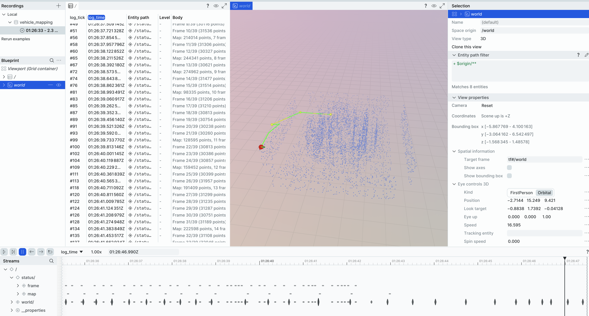

# Vehicle Mapping Pipeline

A Python-based offline mapping pipeline that builds point cloud maps from LiDAR sequences using ICP odometry, GTSAM pose graph optimization, and Open3D map fusion. **Now with DORA dataflow support!**

## Overview

This pipeline processes 32-line LiDAR PCD sequences to create high-quality maps:

```
PCD Files -> ICP (Odometry) -> GTSAM (Pose Graph) -> Open3D (Map Fusion) -> Map + Waypoints
```

**Key Features:**
- **DORA Dataflow**: Real-time visualization with Rerun
- ICP Odometry: Frame-to-frame point cloud registration (Open3D or KISS-ICP)
- GTSAM: Pose graph smoothing with optional loop closure
- Open3D: Point cloud fusion and visualization
- Waypoint Export: Compatible with vehicle-path-following example



## Architecture

```
┌─────────────────────────────────────────────────────────────────────┐
│                      vehicle-map Pipeline                            │
├─────────────────────────────────────────────────────────────────────┤
│                                                                      │
│  ┌──────────────┐    ┌──────────────┐    ┌──────────────┐           │
│  │  PCD Loader  │───>│   KISS-ICP   │───>│    GTSAM     │           │
│  │              │    │   Odometry   │    │  Pose Graph  │           │
│  │  32-line     │    │              │    │  Optimizer   │           │
│  │  LiDAR PCDs  │    │  Frame-to-   │    │              │           │
│  └──────────────┘    │  Frame ICP   │    │  Chain +     │           │
│                      └──────────────┘    │  Loop Close  │           │
│                             │            └──────┬───────┘           │
│                             │                   │                    │
│                             v                   v                    │
│                      ┌──────────────┐    ┌──────────────┐           │
│                      │  Raw Poses   │    │  Optimized   │           │
│                      │  (Odometry)  │    │    Poses     │           │
│                      └──────────────┘    └──────┬───────┘           │
│                                                 │                    │
│                                                 v                    │
│                                          ┌──────────────┐           │
│                                          │   Open3D     │           │
│                                          │  Map Fusion  │           │
│                                          │              │           │
│                                          │  - Transform │           │
│                                          │  - Voxel DS  │           │
│                                          │  - Merge     │           │
│                                          └──────┬───────┘           │
│                                                 │                    │
│                                                 v                    │
│  ┌──────────────────────────────────────────────────────────────┐   │
│  │                         Outputs                               │   │
│  │  - map.ply / map.pcd  (Point cloud map)                      │   │
│  │  - trajectory.txt     (Optimized poses)                      │   │
│  │  - waypoints.txt      (For path-following)                   │   │
│  └──────────────────────────────────────────────────────────────┘   │
└─────────────────────────────────────────────────────────────────────┘
```

## DORA Dataflow Architecture

```
┌─────────────────────────────────────────────────────────────────────────┐
│                     DORA Mapping Dataflow                                │
├─────────────────────────────────────────────────────────────────────────┤
│                                                                          │
│  ┌────────────┐     ┌────────────┐     ┌────────────┐                   │
│  │ pcd_source │────>│icp_odometry│────>│map_builder │                   │
│  │            │     │            │     │            │                   │
│  │ Reads PCD  │     │ Estimates  │     │ Builds     │                   │
│  │ files      │     │ poses      │     │ global map │                   │
│  └─────┬──────┘     └─────┬──────┘     └─────┬──────┘                   │
│        │                  │                  │                           │
│        │                  │                  v                           │
│        │                  │           ┌────────────┐                    │
│        │                  └──────────>│  waypoint  │                    │
│        │                              │ extractor  │                    │
│        │                              └────────────┘                    │
│        │                                                                 │
│        v                                                                 │
│  ┌────────────────────────────────────────────────────────────────┐     │
│  │                    map_visualizer (Rerun)                       │     │
│  │  - Point clouds  - Trajectory  - Waypoints  - Map stats        │     │
│  └────────────────────────────────────────────────────────────────┘     │
│                                                                          │
└─────────────────────────────────────────────────────────────────────────┘
```

## Project Structure

```
vehicle-map/
├── README.md                 # This file
├── dataflow_mapping.yml      # DORA dataflow definition
├── requirements.txt          # Python dependencies
├── config/
│   └── mapping_config.yaml   # Pipeline configuration
├── data/                     # Input PCD files (put your data here)
│   └── rectangle_sequence/   # Synthetic test data
├── output/                   # Generated outputs
├── src/
│   ├── __init__.py
│   ├── operators/            # DORA operators
│   │   ├── pcd_source_op.py
│   │   ├── icp_odometry_op.py
│   │   ├── map_builder_op.py
│   │   ├── waypoint_extractor_op.py
│   │   └── map_visualizer_op.py
│   ├── pcd_loader.py         # Load PCD sequences
│   ├── simple_icp.py         # Open3D ICP odometry
│   ├── kiss_icp_runner.py    # KISS-ICP odometry wrapper
│   ├── pose_graph.py         # GTSAM pose graph optimization
│   ├── loop_detector.py      # Loop closure detection
│   ├── map_builder.py        # Open3D map fusion
│   └── waypoint_extractor.py # Extract waypoints for path-following
└── scripts/
    ├── run_pipeline.py       # Standalone pipeline script
    ├── generate_synthetic_sequence.py  # Generate test PCD from waypoints
    └── visualize_map.py      # Map visualization tool
```

## Installation

### 1. Install DORA and Python Dependencies

```bash
# Install DORA
pip install dora-rs

# Install required packages
pip install numpy pyyaml pyarrow open3d rerun-sdk

# Optional: KISS-ICP (may have issues on macOS ARM64)
pip install kiss-icp
```

### 2. Install GTSAM (Optional but Recommended)

GTSAM provides pose graph optimization. Install via conda:

```bash
conda install -c conda-forge gtsam
```

Or build from source: https://github.com/borglab/gtsam

**Note:** The pipeline works without GTSAM (uses odometry directly), but pose graph optimization significantly improves map quality.

### 3. Verify Installation

```bash
# Check KISS-ICP
kiss_icp_pipeline --help

# Check Open3D
python -c "import open3d; print(f'Open3D {open3d.__version__}')"

# Check GTSAM (optional)
python -c "import gtsam; print('GTSAM available')"
```

## Quick Start

### Option 1: Run with DORA (Recommended)

```bash
cd vehicle-map

# Start DORA daemon
dora up

# Run with synthetic test data (included)
dora start dataflow_mapping.yml --name mapping

# Or specify custom data directory
PCD_DATA_DIR=/path/to/pcds dora start dataflow_mapping.yml --name mapping

# Stop when complete
dora stop --name mapping
```

The Rerun visualizer will open automatically showing:
- Current point cloud scan
- Robot trajectory
- Extracted waypoints
- Map building progress

**Outputs saved to `output/dora_map/`:**
- `map.ply`, `map.pcd` - Point cloud map
- `trajectory.txt` - Estimated poses
- `waypoints.txt` - Path waypoints

### Option 2: Run Standalone Script

```bash
cd vehicle-map

# Basic mapping (uses Simple ICP)
python scripts/run_pipeline.py data/rectangle_sequence -o output --simple-icp

# With Open3D visualization
python scripts/run_pipeline.py data/my_sequence -o output --simple-icp --visualize
```

### Generate Synthetic Test Data

Create PCD sequences from waypoints for testing:

```bash
# Generate from vehicle-path-following waypoints
python scripts/generate_synthetic_sequence.py \
    ../vehicle-path-following/data/sample_waypoints.txt \
    -o data/my_sequence

# Custom spacing between frames
python scripts/generate_synthetic_sequence.py waypoints.txt -o data/test --spacing 0.25
```

### View Results

```bash
# Visualize the map
python scripts/visualize_map.py output/map.ply

# With trajectory overlay
python scripts/visualize_map.py output/map.ply --trajectory output/trajectory.txt
```

## Configuration

Edit `config/mapping_config.yaml` to tune the pipeline:

```yaml
# PCD Loader
loader:
  max_range: 80.0          # LiDAR max range (m)
  min_range: 0.5           # LiDAR min range (m)
  voxel_size: 0.1          # Preprocessing voxel size

# KISS-ICP
kiss_icp:
  voxel_size: 0.5          # ICP voxel size

# GTSAM
gtsam:
  odom_noise:
    rotation: [0.1, 0.1, 0.1]
    translation: [0.05, 0.05, 0.05]

# Loop Closure
loop_closure:
  distance_threshold: 5.0   # Max distance for loop candidates
  min_frame_gap: 50         # Min frames between loops

# Map
map:
  map_voxel_size: 0.05     # Final map resolution

# Waypoints
waypoints:
  min_distance: 0.5        # Spacing between waypoints
```

## Output Files

| File | Description |
|------|-------------|
| `map.ply` | Point cloud map (PLY format) |
| `map.pcd` | Point cloud map (PCD format) |
| `trajectory.txt` | Optimized poses (TUM format) |
| `waypoints.txt` | 2D waypoints for path-following |

## Integration with vehicle-path-following

The extracted waypoints are compatible with the `vehicle-path-following` example:

```bash
# Copy waypoints to path-following example
cp output/waypoints.txt ../vehicle-path-following/data/mapped_path.txt

# Update path-following config
# Edit ../vehicle-path-following/config/sim_config.yaml:
#   paths:
#     waypoints_file: data/mapped_path.txt

# Run the simulation
cd ../vehicle-path-following
dora up
dora start dataflow_sim.yml --name follow_map
```

## Pipeline Components

### 1. PCD Loader (`src/pcd_loader.py`)

Loads and preprocesses PCD files from 32-line LiDAR:
- Range filtering (remove too close/far points)
- Voxel downsampling
- Optional ground removal

### 2. KISS-ICP Runner (`src/kiss_icp_runner.py`)

Wrapper for KISS-ICP odometry:
- Frame-to-frame point cloud registration
- Outputs SE3 poses for each frame
- Supports both Python API and CLI

### 3. Pose Graph Optimizer (`src/pose_graph.py`)

GTSAM-based pose graph optimization:
- Chain of odometry factors
- Optional loop closure constraints
- Levenberg-Marquardt optimization

### 4. Loop Detector (`src/loop_detector.py`)

Detects and verifies loop closures:
- Distance-based candidate detection
- ICP verification
- Optional Scan Context descriptor matching

### 5. Map Builder (`src/map_builder.py`)

Open3D-based map construction:
- Transform frames to global coordinates
- Voxel downsampling
- Statistical outlier removal

### 6. Waypoint Extractor (`src/waypoint_extractor.py`)

Extract path waypoints from trajectory:
- Distance-based filtering
- Douglas-Peucker simplification
- Compatible with vehicle-path-following format

## Troubleshooting

### KISS-ICP not found
```bash
pip install kiss-icp
```

### GTSAM import error
```bash
conda install -c conda-forge gtsam
# Or see https://github.com/borglab/gtsam for building from source
```

### Open3D visualization not working
```bash
# On headless systems, use:
export DISPLAY=:0
# Or save to file and visualize elsewhere
```

### Out of memory with large datasets
- Increase `voxel_size` in config
- Process in chunks
- Use `--save-intermediate` to checkpoint

## References

- [KISS-ICP](https://github.com/PRBonn/kiss-icp) - LiDAR odometry
- [GTSAM](https://gtsam.org/) - Factor graph optimization
- [Open3D](http://www.open3d.org/) - 3D data processing
- [vehicle-path-following](../vehicle-path-following/) - Path following simulation

## License

MIT License
