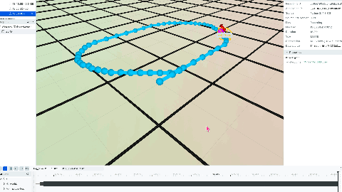

# Vehicle Path Following Simulation

A complete vehicle path-following simulation built with [DORA](Dataflow-Oriented Robotic Architecture). This example demonstrates a kinematic bicycle model vehicle following waypoints using the Pure Pursuit algorithm, with real-time 3D visualization via Rerun.

## Overview

This project simulates an autonomous vehicle navigating a predefined path. It showcases:
- **Kinematic Bicycle Model**: Realistic vehicle motion simulation
- **Pure Pursuit Controller**: Classic path-following algorithm
- **IMU Synthesis**: Generate sensor data from vehicle state
- **Real-time Visualization**: 3D rendering with Rerun



## Architecture

```
                    +------------------+
                    |   Timer (50Hz)   |
                    +--------+---------+
                             |
                             | tick
                             v
+----------------+    +------+-------+    +------------------+
| Simple Planner |<---|Bicycle Model |----> IMU Synthesizer  |
|                |    |              |    +------------------+
| Pure Pursuit   |    | Kinematics   |           |
| Controller     |    | Simulation   |           | imu_msg
+-------+--------+    +------+-------+           v
        |                    |           (available for
        | steering_cmd       | sim_pose   localization)
        | throttle_cmd       | sim_state
        v                    v
        +--------------------+
                    |
                    v
           +-------+--------+
           | Sim Visualizer |
           |                |
           | Rerun 3D View  |
           +----------------+
```

### Dataflow

The system uses DORA's dataflow model where nodes communicate via typed messages:

1. **Timer** (50Hz): Drives the simulation loop
2. **Bicycle Model**: Receives commands, outputs vehicle state
3. **Simple Planner**: Receives pose, outputs steering/throttle commands
4. **IMU Synthesizer**: Generates synthetic IMU data from vehicle motion
5. **Sim Visualizer**: Renders everything in Rerun 3D viewer

## Components

### 1. Bicycle Model (`src/bicycle_model.py`)

Implements a kinematic bicycle model for vehicle simulation.

**Inputs:**
- `tick`: Timer trigger (50Hz)
- `steering_cmd`: Steering angle command (radians)
- `throttle_cmd`: Throttle/brake command (-1.0 to 1.0)

**Outputs:**
- `sim_pose`: Vehicle pose [x, y, theta, velocity]
- `sim_state`: Full state [x, y, theta, velocity, steering, accel, yaw_rate]

**Key Parameters:**
- Wheelbase: 0.5m
- Max speed: 2.0 m/s
- Max steering angle: 0.5 rad (~28 deg)

### 2. Pure Pursuit Controller (`src/simple_planner.py`)

Classic path-following algorithm that computes steering commands to follow waypoints.

**Algorithm:**
1. Find closest waypoint to current position
2. Find lookahead point at distance `L` ahead on path
3. Compute steering angle: `delta = atan(2 * L_wheelbase * sin(alpha) / L_lookahead)`

**Inputs:**
- `sim_pose`: Current vehicle pose

**Outputs:**
- `steering_cmd`: Steering angle command
- `throttle_cmd`: Speed control command
- `target_point`: Current lookahead point (for visualization)
- `waypoints`: Full path (for visualization)

**Key Parameters:**
- Lookahead distance: 0.3m - 1.5m (velocity adaptive)
- Target speed: 0.5 m/s
- Goal tolerance: 0.3m

### 3. IMU Synthesizer (`src/imu_synthesizer.py`)

Generates synthetic IMU data by differentiating vehicle state.

**Outputs:**
- `imu_msg`: [roll, pitch, yaw, gyro_x, gyro_y, gyro_z, accel_x, accel_y, accel_z]

**Features:**
- Configurable noise levels
- Configurable bias
- Body-frame acceleration computation

### 4. Simulation Visualizer (`src/sim_visualizer.py`)

Real-time 3D visualization using Rerun.

**Displays:**
- Vehicle as 3D box with direction arrow
- Path waypoints (cyan)
- Vehicle trail (orange)
- Current target point (magenta)
- Ground grid

## Project Structure

```
vehicle-path-following/
├── README.md                 # This file
├── dataflow_sim.yml          # DORA dataflow configuration
├── config/
│   ├── vehicle_params.yaml   # Vehicle and controller parameters
│   └── sim_config.yaml       # Simulation settings
├── data/
│   └── sample_waypoints.txt  # Path waypoints
└── src/
    ├── bicycle_model.py      # Vehicle dynamics simulation
    ├── simple_planner.py     # Pure pursuit path following
    ├── imu_synthesizer.py    # Synthetic IMU generation
    └── sim_visualizer.py     # Rerun 3D visualization
```

## Requirements

- Python 3.8+
- macOS (Apple Silicon supported) or Linux

### Dependencies

```bash
pip install dora-rs rerun-sdk pyyaml numpy pyarrow
```

## Quick Start

### 1. Install Dependencies

```bash
pip install dora-rs rerun-sdk pyyaml numpy pyarrow
```

### 2. Start DORA Daemon

```bash
cd vehicle-path-following
dora up
```

### 3. Run the Simulation

```bash
dora start dataflow_sim.yml --name vehicle_sim
```

The Rerun visualization window will open automatically showing:
- The vehicle (yellow box) starting at origin
- The path (cyan line and points)
- Vehicle trail as it moves (orange line)

### 4. Stop the Simulation

```bash
dora stop --name vehicle_sim
```

### 5. Cleanup

```bash
dora destroy
```

## Configuration

### Vehicle Parameters (`config/vehicle_params.yaml`)

```yaml
vehicle:
  wheelbase: 0.5              # Distance between axles (m)
  max_speed: 2.0              # Maximum speed (m/s)
  max_steering_angle: 0.5     # Max steering (rad)

controller:
  min_lookahead: 0.3          # Minimum lookahead distance (m)
  max_lookahead: 1.5          # Maximum lookahead distance (m)
  speed_target: 0.5           # Target speed (m/s)
  goal_tolerance: 0.3         # Goal reached threshold (m)
```

### Custom Waypoints

Edit `data/sample_waypoints.txt`:

```
# Format: x y (meters)
# Lines starting with # are comments
0.5 0.0
1.0 0.0
1.5 0.5
1.5 1.0
...
```

## How It Works

### Kinematic Bicycle Model

The bicycle model simplifies a 4-wheeled vehicle to 2 wheels:

```
        Front wheel (steered)
             |
             | L (wheelbase)
             |
        Rear wheel (reference point)
```

**State Update Equations:**
```
x_dot = v * cos(theta)
y_dot = v * sin(theta)
theta_dot = v * tan(delta) / L
```

Where:
- `(x, y)`: Position
- `theta`: Heading angle
- `v`: Velocity
- `delta`: Steering angle
- `L`: Wheelbase

### Pure Pursuit Algorithm

1. **Find Lookahead Point**: Locate a point on the path at distance `L_d` ahead
2. **Compute Curvature**: `kappa = 2 * sin(alpha) / L_d`
3. **Compute Steering**: `delta = atan(L_wheelbase * kappa)`

The lookahead distance adapts to velocity:
```
L_d = L_min + k * |v|
```

## Extending the Example

### Add New Path

1. Create a waypoints file in `data/`
2. Update `config/sim_config.yaml`:
   ```yaml
   paths:
     waypoints_file: data/your_waypoints.txt
   ```

### Tune Controller

Adjust `config/vehicle_params.yaml`:
- Increase `min_lookahead` for smoother but less accurate tracking
- Decrease `speed_target` for tighter turns
- Adjust `lookahead_ratio` for velocity adaptation

### Add Obstacles

Extend `simple_planner.py` to include obstacle detection and avoidance logic.

### Connect to Real Robot

Replace `bicycle_model.py` with a node that:
1. Receives `steering_cmd` and `throttle_cmd`
2. Sends commands to actual motor controllers
3. Publishes real pose from sensors (GPS, odometry, etc.)

## Troubleshooting

### Vehicle doesn't move
- Check if first waypoint is ahead of start position (not at origin)
- Verify goal is far enough from start (> goal_tolerance)

### Vehicle oscillates
- Reduce `speed_target` in config
- Increase `min_lookahead` distance

### Vehicle cuts corners
- Reduce `lookahead_ratio`
- Add more waypoints at curves

### Rerun window doesn't open
- Ensure `rerun-sdk` is installed: `pip install rerun-sdk`
- Try running `rerun` command to verify installation

## License

MIT License - Feel free to use and modify for your projects.

## References

- [DORA Documentation](https://github.com/dora-rs)
- [Rerun Visualization](https://rerun.io/)
- [Pure Pursuit Algorithm](https://www.ri.cmu.edu/pub_files/pub3/coulter_r_craig_1992_1/coulter_r_craig_1992_1.pdf)
- [Bicycle Model](https://thomasfermi.github.io/Algorithms-for-Automated-Driving/Control/BicycleModel.html)
